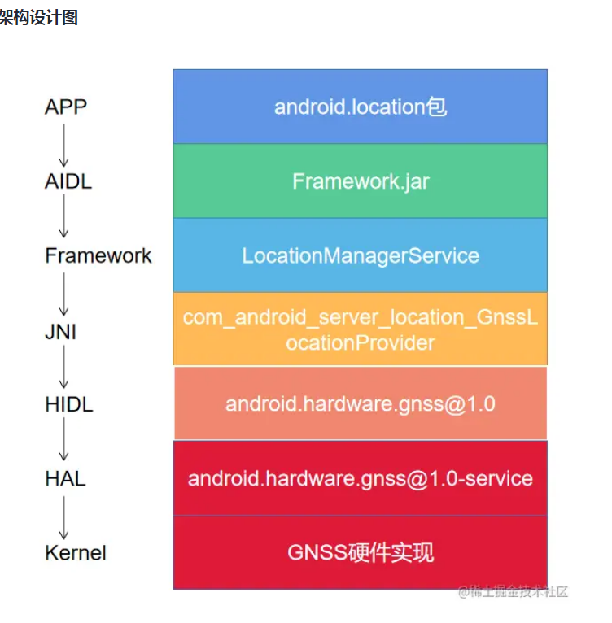

# GNSS

## 简介
GNSS全称是Global Navigation Satellite System，翻译过来叫全球定位卫星导航系统。
实际上GNSS泛指所有的卫星导航系统，包括全球的、区域的和增强的，GPS只是GNSS其中的一种，除了GPS，还有中国的北斗卫星导航系统，俄罗斯的Glonass，欧洲的Galileo等。

移植工作大致分以下几个部分：

1.硬件移植，确定移植哪个厂商的硬件
2.驱动移植，确定Kernel层与HAL层的通信协议，本文采用的UART通信，除此之外还可以使用RIL通信
3.HAL移植，解析NMEA数据，给上层提供接口，供HIDL和JNI调用
4，适配Selinux，添加访问驱动节点的权限
5.应用层测试验证，安装GPS测试工具（高德地图等），测试是否能够获取定位数据

## 软件框架图



APP层
我们在做app开发定位功能时，除了使用高德/百度定位，通常还使用原生的LocationManager来获取定位数据。

```
    //代码5
	private LocationListener locationListener = new LocationListener() {
        @Override
        public void onLocationChanged(@NonNull Location location) {
            //打印定位数据
            Log.d(TAG, "onLocationChanged: " + location.toString());
        }
    };

	public void startLocation(View view) {
        //动态授权
        if (ActivityCompat.checkSelfPermission(this, android.Manifest.permission.ACCESS_FINE_LOCATION) != PackageManager.PERMISSION_GRANTED && ActivityCompat.checkSelfPermission(this, android.Manifest.permission.ACCESS_COARSE_LOCATION) != PackageManager.PERMISSION_GRANTED) {
            Toast.makeText(this, "请先授予定位权限", Toast.LENGTH_SHORT).show();
            return;
        }
        //判断GPS是否打开
        boolean isOpen = checkGPSIsOpen(this);
        if (!isOpen) {
            Toast.makeText(this, "请先打开GPS", Toast.LENGTH_SHORT).show();
            goToGpsSetting(this);
            return;
        }
        //获取定位服务，请求定位数据
        LocationManager locationManager = (LocationManager) this.getSystemService(Context.LOCATION_SERVICE);
        locationManager.requestLocationUpdates(LocationManager.GPS_PROVIDER, 1000, 0.01f, locationListener);
    }

```

AIDL层
上述代码主要是通过locationManager.requestLocationUpdates()来获取定位数据

```
public class LocationManager {
    @RequiresPermission(anyOf = {ACCESS_COARSE_LOCATION, ACCESS_FINE_LOCATION})
    public void requestLocationUpdates(@NonNull String provider, long minTimeMs, float minDistanceM,
            @NonNull LocationListener listener, @Nullable Looper looper) {
        Handler handler = looper == null ? new Handler() : new Handler(looper);
        requestLocationUpdates(provider, minTimeMs, minDistanceM, new HandlerExecutor(handler),
                listener);
    }

    @RequiresPermission(anyOf = {ACCESS_COARSE_LOCATION, ACCESS_FINE_LOCATION})
    public void requestLocationUpdates(@NonNull String provider,
            @NonNull LocationRequest locationRequest,
            @NonNull @CallbackExecutor Executor executor,
            @NonNull LocationListener listener) {
        Preconditions.checkArgument(provider != null, "invalid null provider");
        Preconditions.checkArgument(locationRequest != null, "invalid null location request");

        try {
            synchronized (sLocationListeners) {
                WeakReference<LocationListenerTransport> reference = sLocationListeners.get(
                        listener);
                LocationListenerTransport transport = reference != null ? reference.get() : null;
                if (transport == null) {
                    transport = new LocationListenerTransport(listener, executor);
                } else {
                    Preconditions.checkState(transport.isRegistered());
                    transport.setExecutor(executor);
                }
            //调用AIDL requestLocationUpdates()方法
                mService.registerLocationListener(provider, locationRequest, transport,
                        mContext.getPackageName(), mContext.getAttributionTag(),
                        AppOpsManager.toReceiverId(listener));

                sLocationListeners.put(listener, new WeakReference<>(transport));
            }
        } catch (RemoteException e) {
            throw e.rethrowFromSystemServer();
        }
    }
}
```

可以看到最终通过mService调用了远程LocationManagerService里面的方法，mService是一个ILocationManager.aidl接口，该接口定义如下：

```
interface ILocationManager
{
    @nullable Location getLastLocation(String provider, in LastLocationRequest request, String packageName, @nullable String attributionTag);
    @nullable ICancellationSignal getCurrentLocation(String provider, in LocationRequest request, in ILocationCallback callback, String packageName, @nullable String attributionTag, String listenerId);

    void registerLocationListener(String provider, in LocationRequest request, in ILocationListener listener, String packageName, @nullable String attributionTag, String listenerId);
    void unregisterLocationListener(in ILocationListener listener);

    void registerLocationPendingIntent(String provider, in LocationRequest request, in PendingIntent pendingIntent, String packageName, @nullable String attributionTag);
    void unregisterLocationPendingIntent(in PendingIntent pendingIntent);

    @EnforcePermission(allOf={"LOCATION_HARDWARE", "ACCESS_FINE_LOCATION"})
    void injectLocation(in Location location);

    void requestListenerFlush(String provider, in ILocationListener listener, int requestCode);
    void requestPendingIntentFlush(String provider, in PendingIntent pendingIntent, int requestCode);

    void requestGeofence(in Geofence geofence, in PendingIntent intent, String packageName, String attributionTag);
    void removeGeofence(in PendingIntent intent);

    boolean isGeocodeAvailable();
    void reverseGeocode(in ReverseGeocodeRequest request, in IGeocodeCallback callback);
    void forwardGeocode(in ForwardGeocodeRequest request, in IGeocodeCallback callback);

    GnssCapabilities getGnssCapabilities();
    int getGnssYearOfHardware();
    String getGnssHardwareModelName();
    ...
}
```

LocationManagerService继承了ILocationManager.Stub，实现了ILocationManager.aidl里面所有的方法。

```
public class LocationManagerService extends ILocationManager.Stub implements{

    @Override
    public void registerLocationListener(String provider, LocationRequest request,
            ILocationListener listener, String packageName, @Nullable String attributionTag,
            String listenerId) {
        ActivityManagerInternal managerInternal =
                LocalServices.getService(ActivityManagerInternal.class);
        if (managerInternal != null) {
            managerInternal.logFgsApiBegin(ActivityManager.FOREGROUND_SERVICE_API_TYPE_LOCATION,
                    Binder.getCallingUid(), Binder.getCallingPid());
        }
        CallerIdentity identity = CallerIdentity.fromBinder(mContext, packageName, attributionTag,
                listenerId);
        int permissionLevel = LocationPermissions.getPermissionLevel(mContext, identity.getUid(),
                identity.getPid());
        if (Flags.enableLocationBypass()) {
            if (permissionLevel == PERMISSION_NONE) {
                if (mContext.checkCallingPermission(LOCATION_BYPASS) != PERMISSION_GRANTED) {
                    LocationPermissions.enforceLocationPermission(
                            identity.getUid(), permissionLevel, PERMISSION_COARSE);
                } else {
                    permissionLevel = PERMISSION_FINE;
                }
            }
        } else {
            LocationPermissions.enforceLocationPermission(identity.getUid(), permissionLevel,
                    PERMISSION_COARSE);
        }

        // clients in the system process should have an attribution tag set
        if (identity.getPid() == Process.myPid() && attributionTag == null) {
            Log.w(TAG, "system location request with no attribution tag",
                    new IllegalArgumentException());
        }

        request = validateLocationRequest(provider, request, identity);

        LocationProviderManager manager = getLocationProviderManager(provider);
        Preconditions.checkArgument(manager != null,
                "provider \"" + provider + "\" does not exist");

        manager.registerLocationRequest(request, identity, permissionLevel, listener);
    }
...
}
```
也就是说LocationManagerService向上层提供了所有定位相关的API

虽然LocationManagerService提供了很多定位相关的API，但它本省并不是Service，因为它继承的是ILocationManager.Stub，那它是怎么创建并能保持运行的呢，这依赖它的内部类LocationManagerService.Lifecycle


```
public class LocationManagerService extends ILocationManager.Stub implements{
     public static class Lifecycle extends SystemService {

        private final LifecycleUserInfoHelper mUserInfoHelper;
        private final SystemInjector mSystemInjector;
        private final LocationManagerService mService;

        public Lifecycle(Context context) {
            super(context);
            mUserInfoHelper = new LifecycleUserInfoHelper(context);
            mSystemInjector = new SystemInjector(context, mUserInfoHelper);
            mService = new LocationManagerService(context, mSystemInjector);
        }

        @Override
        public void onStart() {
            publishBinderService(Context.LOCATION_SERVICE, mService);

            // client caching behavior is only enabled after seeing the first invalidate
            LocationManager.invalidateLocalLocationEnabledCaches();
            // disable caching for our own process
            LocationManager.disableLocalLocationEnabledCaches();
        }
        ...
     }
     ...
}
```

LocationManagerService.Lifecycle继承自SystemService，说明它是一个系统服务，并且随着系统的启动而启动，在SystemServer中

```
public final class SystemServer implements Dumpable {

    public static void main(String[] args) {
        new SystemServer().run();
    }

    private void run() {
        ...
        try {
            t.traceBegin("StartServices");
            startBootstrapServices(t);
            startCoreServices(t);
            startOtherServices(t);
            startApexServices(t);
            // Only update the timeout after starting all the services so that we use
            // the default timeout to start system server.
            updateWatchdogTimeout(t);
            CriticalEventLog.getInstance().logSystemServerStarted();
        } catch (Throwable ex) {
            Slog.e("System", "******************************************");
            Slog.e("System", "************ Failure starting system services", ex);
            throw ex;
        } finally {
            t.traceEnd(); // StartServices
        }
        ...
        private void startOtherServices(@NonNull TimingsTraceAndSlog t) {
            //启动LocationManagerService.Lifecycle
            t.traceBegin("StartLocationManagerService");
            mSystemServiceManager.startService(LocationManagerService.Lifecycle.class);
            t.traceEnd(); 
        }
    }
}
```

@frameworks/base/services/core/java/com/android/server/location/LocationManagerService.java
当LocationManagerService启动完毕之后会执行onSystemThirdPartyAppsCanStart()，此方法内开始初始化Gnss。

```
public class LocationManagerService extends ILocationManager.Stub implements{
    ...
    void onSystemThirdPartyAppsCanStart() {
    // network provider should always be initialized before the gps provider since the gps
    // provider has unfortunate hard dependencies on the network provider
    ProxyLocationProvider networkProvider = ProxyLocationProvider.create(
            mContext,
            NETWORK_PROVIDER,
            ACTION_NETWORK_PROVIDER,
            com.android.internal.R.bool.config_enableNetworkLocationOverlay,
            com.android.internal.R.string.config_networkLocationProviderPackageName);
    if (networkProvider != null) {
        LocationProviderManager networkManager = new LocationProviderManager(mContext,
                mInjector, NETWORK_PROVIDER, mPassiveManager);
        addLocationProviderManager(networkManager, networkProvider);
    } else {
        Log.w(TAG, "no network location provider found");
    }

    // ensure that a fused provider exists which will work in direct boot
    Preconditions.checkState(!mContext.getPackageManager().queryIntentServicesAsUser(
            new Intent(ACTION_FUSED_PROVIDER),
            MATCH_DIRECT_BOOT_AWARE | MATCH_SYSTEM_ONLY, UserHandle.USER_SYSTEM).isEmpty(),
            "Unable to find a direct boot aware fused location provider");

    ProxyLocationProvider fusedProvider = ProxyLocationProvider.create(
            mContext,
            FUSED_PROVIDER,
            ACTION_FUSED_PROVIDER,
            com.android.internal.R.bool.config_enableFusedLocationOverlay,
            com.android.internal.R.string.config_fusedLocationProviderPackageName);
    if (fusedProvider != null) {
        LocationProviderManager fusedManager = new LocationProviderManager(mContext, mInjector,
                FUSED_PROVIDER, mPassiveManager);
        addLocationProviderManager(fusedManager, fusedProvider);
    } else {
        Log.wtf(TAG, "no fused location provider found");
    }

    // initialize gnss last because it has no awareness of boot phases and blindly assumes that
    // all other location providers are loaded at initialization
    boolean hasLocationFeature = mContext.getPackageManager().hasSystemFeature(
            PackageManager.FEATURE_LOCATION);
    if (hasLocationFeature && GnssNative.isSupported()) {
        GnssConfiguration gnssConfiguration = new GnssConfiguration(mContext);
        GnssNative gnssNative = GnssNative.create(mInjector, gnssConfiguration);
        //只有设备支持Gnss才会初始化
        //创建GnssManagerService
        mGnssManagerService = new GnssManagerService(mContext, mInjector, gnssNative);
        mGnssManagerService.onSystemReady();

        boolean useGnssHardwareProvider = mContext.getResources().getBoolean(
                com.android.internal.R.bool.config_useGnssHardwareProvider);
        AbstractLocationProvider gnssProvider = null;
        if (!useGnssHardwareProvider) {
            // TODO: Create a separate config_enableGnssLocationOverlay config resource
            // if we want to selectively enable a GNSS overlay but disable a fused overlay.
            gnssProvider = ProxyLocationProvider.create(
                    mContext,
                    GPS_PROVIDER,
                    ACTION_GNSS_PROVIDER,
                    com.android.internal.R.bool.config_enableFusedLocationOverlay,
                    com.android.internal.R.string.config_gnssLocationProviderPackageName);
        }
        if (gnssProvider == null) {
            gnssProvider = mGnssManagerService.getGnssLocationProvider();
        } else {
            // If we have a GNSS provider override, add the hardware provider as a standalone
            // option for use by apps with the correct permission. Note the GNSS HAL can only
            // support a single client, so mGnssManagerService.getGnssLocationProvider() can
            // only be installed with a single provider. Locations from this provider won't
            // be reported through the passive provider.
            LocationProviderManager gnssHardwareManager =
                    new LocationProviderManager(
                            mContext,
                            mInjector,
                            GPS_HARDWARE_PROVIDER,
                            /*passiveManager=*/ null,
                            Collections.singletonList(Manifest.permission.LOCATION_HARDWARE));
            addLocationProviderManager(
                    gnssHardwareManager, mGnssManagerService.getGnssLocationProvider());
        }
        //创建LocationProviderManager，并且设置定位类型为GPS
        LocationProviderManager gnssManager = new LocationProviderManager(mContext, mInjector,
                GPS_PROVIDER, mPassiveManager);
        addLocationProviderManager(gnssManager, gnssProvider);
    }

    // bind to geocoder provider
    mGeocodeProvider = ProxyGeocodeProvider.createAndRegister(mContext);
    if (mGeocodeProvider == null) {
        Log.e(TAG, "no geocoder provider found");
    }

    // bind to hardware activity recognition
    HardwareActivityRecognitionProxy hardwareActivityRecognitionProxy =
            HardwareActivityRecognitionProxy.createAndRegister(mContext);
    if (hardwareActivityRecognitionProxy == null) {
        Log.e(TAG, "unable to bind ActivityRecognitionProxy");
    }

    // bind to gnss geofence proxy
    if (mGnssManagerService != null) {
        //创建地理围栏并与GnssManagerService绑定
        GeofenceProxy provider = GeofenceProxy.createAndBind(mContext,
                mGnssManagerService.getGnssGeofenceProxy());
        if (provider == null) {
            Log.e(TAG, "unable to bind to GeofenceProxy");
        }
    }

    // create any predefined test providers
    String[] testProviderStrings = mContext.getResources().getStringArray(
            com.android.internal.R.array.config_testLocationProviders);
    for (String testProviderString : testProviderStrings) {
        String[] fragments = testProviderString.split(",");
        String name = fragments[0].trim();
        ProviderProperties properties = new ProviderProperties.Builder()
                .setHasNetworkRequirement(Boolean.parseBoolean(fragments[1]))
                .setHasSatelliteRequirement(Boolean.parseBoolean(fragments[2]))
                .setHasCellRequirement(Boolean.parseBoolean(fragments[3]))
                .setHasMonetaryCost(Boolean.parseBoolean(fragments[4]))
                .setHasAltitudeSupport(Boolean.parseBoolean(fragments[5]))
                .setHasSpeedSupport(Boolean.parseBoolean(fragments[6]))
                .setHasBearingSupport(Boolean.parseBoolean(fragments[7]))
                .setPowerUsage(Integer.parseInt(fragments[8]))
                .setAccuracy(Integer.parseInt(fragments[9]))
                .build();
        final LocationProviderManager manager = getOrAddLocationProviderManager(name);
        manager.setMockProvider(new MockLocationProvider(properties,
                CallerIdentity.fromContext(mContext), Collections.emptySet()));
    }
  }

}
```

首先判断设备是否支持Gnss，判断方式是看设备是否有Gnss Hal Service在运行。具体见源码:

```
@frameworks\base\services\core\java\com\android\server\location\gnss\hal\GnssNative.java
public class GnssNative {
    public static synchronized boolean isSupported() {
        initializeHal();
        return sGnssHal.isSupported();
    }
    public static class GnssHal {
        ...
        protected boolean isSupported() {
            return native_is_supported();
        }
    }
}
```

native源码对应在frameworks/base/services/core/jni/com_android_server_location_GnssLocationProvider.cpp

```
@frameworks/base/services/core/jni/com_android_server_location_GnssLocationProvider.cpp

static jboolean android_location_gnss_hal_GnssNative_is_supported(JNIEnv* /* env */, jclass) {
    return (gnssHal != nullptr && gnssHal->isSupported()) ? JNI_TRUE : JNI_FALSE;
}


static const JNINativeMethod sCoreMethods[] = {
    /* name, signature, funcPtr */
    {"native_class_init_once", "()V",
     reinterpret_cast<void*>(android_location_gnss_hal_GnssNative_class_init_once)},
    {"native_is_supported", "()Z",
     reinterpret_cast<void*>(android_location_gnss_hal_GnssNative_is_supported)},
    {"native_init_once", "(Z)V",
     reinterpret_cast<void*>(android_location_gnss_hal_GnssNative_init_once)},
};
```


如果设备支持Gnss，则进行一系列的初始化，首先是创建GnssManagerService，然后创建LocationProviderManager，最后创建GeofenceProxy并与GnssManagerService绑定，这里的绑定实际上创建了GeofenceHardwareService，然后通过bindServiceAsUser()的方式与Context进程进行绑定java 代码解读复制代码

```
public final class GeofenceProxy implements ServiceListener<BoundServiceInfo> {
    
    public static GeofenceProxy createAndBind(Context context, IGpsGeofenceHardware gpsGeofence) {
        GeofenceProxy proxy = new GeofenceProxy(context, gpsGeofence);
        if (proxy.register(context)) {
            return proxy;
        } else {
            return null;
        }
    }
    
    private boolean register(Context context) {
        boolean resolves = mServiceWatcher.checkServiceResolves();
        if (resolves) {
            mServiceWatcher.register();
            //context进程与GeofenceHardwareService进行绑定
            context.bindServiceAsUser(
                    new Intent(context, GeofenceHardwareService.class),
                    new GeofenceProxyServiceConnection(),
                    Context.BIND_AUTO_CREATE,
                    UserHandle.SYSTEM);
        }
        return resolves;
    }
}
```
下面我们看数据定位流程。
```
public class LocationManager {
    ...
    @RequiresPermission(anyOf = {ACCESS_COARSE_LOCATION, ACCESS_FINE_LOCATION})
    public void requestLocationUpdates(@NonNull String provider,
            @NonNull LocationRequest locationRequest,
            @NonNull @CallbackExecutor Executor executor,
            @NonNull LocationListener listener) {
        //判断权限
        Preconditions.checkArgument(provider != null, "invalid null provider");//
        Preconditions.checkArgument(locationRequest != null, "invalid null location request");

        try {
            synchronized (sLocationListeners) {
                WeakReference<LocationListenerTransport> reference = sLocationListeners.get(
                        listener);
                LocationListenerTransport transport = reference != null ? reference.get() : null;
                if (transport == null) {
                    //注册listener
                    transport = new LocationListenerTransport(listener, executor);
                } else {
                    Preconditions.checkState(transport.isRegistered());
                    transport.setExecutor(executor);
                }
                //注册listener
                mService.registerLocationListener(provider, locationRequest, transport,
                        mContext.getPackageName(), mContext.getAttributionTag(),
                        AppOpsManager.toReceiverId(listener));

                sLocationListeners.put(listener, new WeakReference<>(transport));
            }
        } catch (RemoteException e) {
            throw e.rethrowFromSystemServer();
        }
    }
    ...
}

```

发送的请求最终在线程池中，交由AbstractLocationProvider的onSetRequest()方法完成，onSetRequest()是抽象方法，具体实现由AbstractLocationProvider的子类GnssLocationProvider完成

```
    @Override
    public void setRequest(ProviderRequest request) {
        try {
            onSetRequest(request);
        } catch (RuntimeException e) {
            // exceptions on one-way binder threads are dropped - move to a different thread
            Log.w(mTag, e);
            new Handler(Looper.getMainLooper()).post(() -> {
                throw new AssertionError(e);
            });
        }
    }
```

跳进onSetRequest函数可知，
```
@frameworks\base\services\core\java\com\android\server\location\provider\AbstractLocationProvider.java
public abstract class AbstractLocationProvider {
    ...
    protected abstract void onSetRequest(ProviderRequest request);
    ...
}
```

onSetRequest调用ILocationProvider.aidl接口
```
@frameworks\base\services\core\java\com\android\server\location\provider\AbstractLocationProvider.java
public abstract class AbstractLocationProvider {
    ...
    protected abstract void onSetRequest(ProviderRequest request);
    ...
}
```

方法完成，onSetRequest实现是在AbstractLocationProvider里面实现的

```
@frameworks\base\services\core\java\com\android\server\location\gnss\GnssLocationProvider.java
public class GnssLocationProvider extends AbstractLocationProvider implements
        InjectTimeCallback, GnssSatelliteBlocklistCallback, GnssNative.BaseCallbacks,
        GnssNative.LocationCallbacks, GnssNative.SvStatusCallbacks, GnssNative.AGpsCallbacks,
        GnssNative.PsdsCallbacks, GnssNative.NotificationCallbacks,
        GnssNative.LocationRequestCallbacks, GnssNative.TimeCallbacks {     
    ...           
    @Override
    public void onSetRequest(ProviderRequest request) {
        mProviderRequest = request;
        updateEnabled();
        updateRequirements();
    }
    ...
    private void handleEnable() {
        if (DEBUG) Log.d(TAG, "handleEnable");
        //GNSS hal层初始化
        boolean inited = mGnssNative.init();

        if (inited) {
            //打开GPS
            setGpsEnabled(true);
            mSupportsPsds = mGnssNative.isPsdsSupported();

            // TODO: remove the following native calls if we can make sure they are redundant.
            if (mSuplServerHost != null) {
                mGnssNative.setAgpsServer(GnssNetworkConnectivityHandler.AGPS_TYPE_SUPL,
                        mSuplServerHost, mSuplServerPort);
            }
            if (mC2KServerHost != null) {
                mGnssNative.setAgpsServer(GnssNetworkConnectivityHandler.AGPS_TYPE_C2K,
                        mC2KServerHost, mC2KServerPort);
            }

            mBatchingEnabled = mGnssNative.initBatching() && mGnssNative.getBatchSize() > 1;
            if (mGnssVisibilityControl != null) {
                mGnssVisibilityControl.onGpsEnabledChanged(/* isEnabled= */ true);
            }
        } else {
            setGpsEnabled(false);
            Log.w(TAG, "Failed to enable location provider");
        }
    }
    ...
}

```

由上可知，在handleEnable实行一些初始化的工作。其中mGnssNative.init()调用GnssNative类中init方法
```
@frameworks\base\services\core\java\com\android\server\location\gnss\hal\GnssNative.java
public class GnssNative {
...
    public boolean init() {
        Preconditions.checkState(mRegistered);
        return mGnssHal.init();
    }
    public static class GnssHal {
        ...
        protected boolean init() {
            return native_init();
        }
        ...
    }
}
```
最后在GnassHal类native_init()方法实现内容在JNI层中com_android_server_location_GnssLocationProvider.cpp

```
static const JNINativeMethod sLocationProviderMethods[] = {
    /* name, signature, funcPtr */
    {"native_init", "()Z", reinterpret_cast<void*>(android_location_gnss_hal_GnssNative_init)},
    {"native_cleanup", "()V",
     reinterpret_cast<void*>(android_location_gnss_hal_GnssNative_cleanup)},
    {"native_set_position_mode", "(IIIIIZ)Z",
     reinterpret_cast<void*>(android_location_gnss_hal_GnssNative_set_position_mode)},
    {"native_start", "()Z",
     reinterpret_cast<void*>(android_location_gnss_hal_GnssNative_start)},
    {"native_stop", "()Z", reinterpret_cast<void*>(android_location_gnss_hal_GnssNative_stop)},
    ...
};
```


```
/* Initialization needed each time the GPS service is shutdown. */
static jboolean android_location_gnss_hal_GnssNative_init(JNIEnv* /* env */, jclass) {
    /*
     * This must be set before calling into the HAL library.
     */
    if (!mCallbacksObj) {
        ALOGE("No callbacks set during GNSS HAL initialization.");
        return JNI_FALSE;
    }

    /*
     * Fail if the main interface fails to initialize
     */
    if (!gnssHal->isSupported()) {
        ALOGE("Unable to initialize GNSS HAL.");
        return JNI_FALSE;
    }

    // Set top level IGnss HAL callback.
    gnssHal->setCallback();

    // Set IGnssPsds callback.
    if (gnssPsdsIface == nullptr ||
        !gnssPsdsIface->setCallback(std::make_unique<gnss::GnssPsdsCallback>())) {
        ALOGI("Unable to initialize IGnssPsds interface.");
    }

    // Set IAGnss callback.
    if (agnssIface == nullptr ||
        !agnssIface->setCallback(std::make_unique<gnss::AGnssCallback>())) {
        ALOGI("Unable to initialize IAGnss interface.");
    }

    // Set GnssGeofence callback.
    if (gnssGeofencingIface != nullptr) {
        gnssGeofencingIface->setCallback(std::make_unique<gnss::GnssGeofenceCallback>());
    } else {
        ALOGI("Unable to initialize IGnssGeofencing interface.");
    }

    // Set IAGnssRil callback.
    if (agnssRilIface == nullptr ||
        !agnssRilIface->setCallback(std::make_unique<gnss::AGnssRilCallback>())) {
        ALOGI("Unable to initialize IAGnssRil interface.");
    }

    // Set IGnssVisibilityControl callback.
    if (gnssVisibilityControlIface != nullptr) {
        gnssVisibilityControlIface->setCallback(
                std::make_unique<gnss::GnssVisibilityControlCallback>());
    } else {
        ALOGI("Unable to initialize IGnssVisibilityControl interface.");
    }

    // Set IMeasurementCorrection callback.
    if (gnssMeasurementCorrectionsIface == nullptr ||
        !gnssMeasurementCorrectionsIface->setCallback(
                std::make_unique<gnss::MeasurementCorrectionsCallback>())) {
        ALOGI("Unable to initialize IGnssMeasurementCorrections interface.");
    }

    // Set IGnssPowerIndication.hal callback.
    if (gnssPowerIndicationIface != nullptr) {
        sp<IGnssPowerIndicationCallback> gnssPowerIndicationCallback =
                new GnssPowerIndicationCallback();
        auto status = gnssPowerIndicationIface->setCallback(gnssPowerIndicationCallback);
        if (!checkAidlStatus(status, "IGnssPowerIndication setCallback() failed.")) {
            gnssPowerIndicationIface = nullptr;
        }
    }

    return JNI_TRUE;
}
```

从android_location_gnss_hal_GnssNative_init函数可知，所有操作都是从java->jni->native->hal,现在我们来看看hal里面的实现,可以查看Gnss.cpp代码。
```
ScopedAStatus Gnss::start() {
    ALOGD("start()");
    if (mIsActive) {
        ALOGW("Gnss has started. Restarting...");
        stop();
    }

    mIsActive = true;
    mThreadBlocker.reset();
    // notify measurement engine to update measurement interval
    mGnssMeasurementInterface->setLocationEnabled(true);
    this->reportGnssStatusValue(IGnssCallback::GnssStatusValue::SESSION_BEGIN);

    if (mGnssIface == nullptr) {
        ALOGE("%s: Gnss interface is unavailable", __func__);
        return ndk::ScopedAStatus::fromServiceSpecificError(IGnss::ERROR_GENERIC);
    }

    return (mGnssIface->start() == 0) ? \
           ScopedAStatus::ok() : ndk::ScopedAStatus::fromServiceSpecificError(IGnss::ERROR_GENERIC);
}

ScopedAStatus Gnss::stop() {
    ALOGD("stop");
    mIsActive = false;
    mGnssMeasurementInterface->setLocationEnabled(false);
    this->reportGnssStatusValue(IGnssCallback::GnssStatusValue::SESSION_END);

    if (mGnssIface == nullptr) {
        ALOGE("%s: Gnss interface is unavailable", __func__);
        return ndk::ScopedAStatus::fromServiceSpecificError(IGnss::ERROR_GENERIC);
    }
    return (mGnssIface->stop() == 0) ? \
           ScopedAStatus::ok() : ndk::ScopedAStatus::fromServiceSpecificError(IGnss::ERROR_GENERIC);
}
...
```


## 数据上报

与此同时，hal层接收硬件层返回的数据是在locationCb()，此方法拿到定位数据后，层层往上回调，先是到达frameworks\base\services\core\jni\gnss\GnssCallback.cpp的gnssLocationCb()


```
template <class T>
Return<void> GnssCallbackHidl::gnssLocationCbImpl(const T& location) {
    JNIEnv* env = getJniEnv();

    jobject jLocation = translateGnssLocation(env, location);

    env->CallVoidMethod(mCallbacksObj, method_reportLocation, boolToJbool(hasLatLong(location)),
                        jLocation);
    checkAndClearExceptionFromCallback(env, __FUNCTION__);
    env->DeleteLocalRef(jLocation);
    return Void();
}

Return<void> GnssCallbackHidl::gnssLocationCb(const GnssLocation_V1_0& location) {
    来自hal回调
    return gnssLocationCbImpl<GnssLocation_V1_0>(location);
}

void Gnss_class_init_once(JNIEnv* env, jclass& clazz) {
    method_reportLocation =
            env->GetMethodID(clazz, "reportLocation", "(ZLandroid/location/Location;)V");
    ...
}

```


其中onReportLocation会调用handleReportLocation处理位置
```
public class GnssLocationProvider extends AbstractLocationProvider implements
        InjectTimeCallback, GnssSatelliteBlocklistCallback, GnssNative.BaseCallbacks,
        GnssNative.LocationCallbacks, GnssNative.SvStatusCallbacks, GnssNative.AGpsCallbacks,
        GnssNative.PsdsCallbacks, GnssNative.NotificationCallbacks,
        GnssNative.LocationRequestCallbacks, GnssNative.TimeCallbacks {
    ...
    @Override
    public void onReportLocation(boolean hasLatLong, Location location) {
        postWithWakeLockHeld(() -> handleReportLocation(hasLatLong, location));
    }
    ...
}
```

```
    private void handleReportLocation(boolean hasLatLong, Location location) {
        if (VERBOSE) Log.v(TAG, "reportLocation " + location.toString());

        location.setExtras(mLocationExtras.getBundle());

        try {
            reportLocation(LocationResult.wrap(location).validate());
        } catch (BadLocationException e) {
            Log.e(TAG, "Dropping invalid location: " + e);
            return;
        }

      ...

```

上述代码reportLocation会调用回调给AbstractLocationProvider.java的 reportLocation()方法来处理。

```
    protected void reportLocation(LocationResult locationResult) {
        Listener listener = mInternalState.get().listener;
        if (listener != null) {
            final long identity = Binder.clearCallingIdentity();
            try {
                listener.onReportLocation(Objects.requireNonNull(locationResult));
            } finally {
                Binder.restoreCallingIdentity(identity);
            }
        }
    }
```